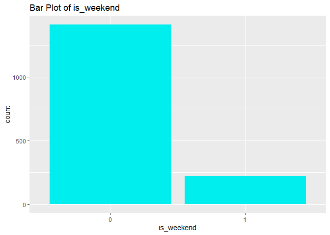
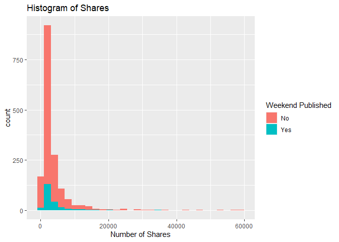
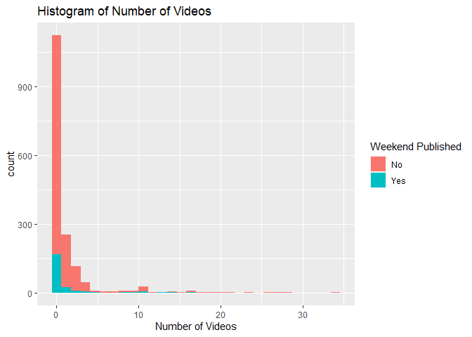
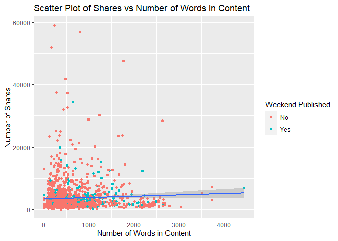
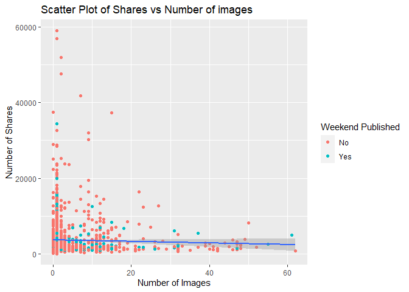

ST558 Project2
================
Shan Luo, Chengxi Zhou
2022-07-03

# Introduction

We are trying to predict the number of shares in social networks using
predictive models among different data channels. The data set we have is
the Online News Popularity Data Set, which summarizes a heterogeneous
set of features about articles published by Mashable in two years.

Since the number of shares is our target variable, the dependent
variable in models would be **shares**.

Intuitively, the *number of words in the content*, *number of images*,
*number of videos*, *rate of positive words in the content*, *text
subjectivity* and *whether published on the weekend or not* would affect
the number of shares, so we choose **n_tokens_content**, **num_imgs**,
**num_videos**, **global_rate_positive_words**, **global_subjectivity**
and **is_weekend** to be the independent variables.

We also take the article categories into our consideration: the effects
of variables mentioned above may vary on different types of articles. In
order to study that, we could subset the data into each levels of
article types before modeling. There exists six types in our data set:
lifestyle, entertainment, bus, socmed, tech and world.

As we want to investigate the effect of these independent variables on
the number of shares, the first step would be presenting a brief EDA to
have a preliminary understanding of data, then modeling data with
predictive models and compare them.

The predictive models we choose are linear regression model and ensemble
tree-based models, which we’ll describe more later.

# Data

``` r
# Read in data and subset data
News <- read_csv("OnlineNewsPopularity.csv", show_col_types = FALSE) 
News <- News %>% 
  filter(!!rlang::sym(params$Channels) == 1) %>%
  select(shares, n_tokens_content, num_imgs, num_videos,
         global_rate_positive_words, global_subjectivity, is_weekend)

# convert the is_weekend variable to a factor
News$is_weekend <- factor(News$is_weekend)
News
```

    ## # A tibble: 2,323 × 7
    ##    shares n_tokens_content num_imgs num_videos global_rate_posit…
    ##     <dbl>            <dbl>    <dbl>      <dbl>              <dbl>
    ##  1   2600              257        0          1             0.0311
    ##  2    690              218       11          0             0.0550
    ##  3   4800             1226        1          1             0.0228
    ##  4    851             1121        1          0             0.0562
    ##  5   4800              168       11          0             0.0714
    ##  6   9200              100        1          0             0.07  
    ##  7   1600             1596        8          0             0.0533
    ##  8    775              518        1          0             0.0676
    ##  9  18200              358        1          0             0.0391
    ## 10   1600              358        1          0             0.0559
    ## # … with 2,313 more rows, and 2 more variables:
    ## #   global_subjectivity <dbl>, is_weekend <fct>

``` r
# Split train and test data
set.seed(1)
trainIndex <- createDataPartition(News$shares, p = 0.7, list = FALSE)
train <- News[trainIndex, ]
test <- News[-trainIndex, ]
```

``` r
# Check correlation of all interested variables
cor(select(News ,shares, n_tokens_content, num_imgs, num_videos,
           global_rate_positive_words, global_subjectivity))
```

    ##                                  shares n_tokens_content
    ## shares                      1.000000000       0.04795934
    ## n_tokens_content            0.047959339       1.00000000
    ## num_imgs                   -0.034796518       0.51969089
    ## num_videos                  0.015893010      -0.01768815
    ## global_rate_positive_words -0.007225248       0.08783301
    ## global_subjectivity        -0.007585586       0.11320093
    ##                               num_imgs  num_videos
    ## shares                     -0.03479652  0.01589301
    ## n_tokens_content            0.51969089 -0.01768815
    ## num_imgs                    1.00000000 -0.10202484
    ## num_videos                 -0.10202484  1.00000000
    ## global_rate_positive_words  0.05672248  0.11907336
    ## global_subjectivity         0.13071261  0.15330875
    ##                            global_rate_positive_words
    ## shares                                   -0.007225248
    ## n_tokens_content                          0.087833012
    ## num_imgs                                  0.056722478
    ## num_videos                                0.119073363
    ## global_rate_positive_words                1.000000000
    ## global_subjectivity                       0.262903823
    ##                            global_subjectivity
    ## shares                            -0.007585586
    ## n_tokens_content                   0.113200929
    ## num_imgs                           0.130712612
    ## num_videos                         0.153308750
    ## global_rate_positive_words         0.262903823
    ## global_subjectivity                1.000000000

If two variables have high correlation, we may think about removing one
of them.

# EDA

## Numeric Summary Table

``` r
# Compute the summary statistics
apply(X = select(train, shares:global_subjectivity), MARGIN = 2,
      FUN = function(x) {
        summaries <- c(min(x), mean(x), median(x), max(x), sd(x), IQR(x))
        names(summaries) <- c("Min", "Mean", "Median", "Max", "Sd", "IQR")
        summaries
      })
```

    ##           shares n_tokens_content  num_imgs num_videos
    ## Min        5.000           0.0000  0.000000   0.000000
    ## Mean    3550.980         605.7150  4.270885   1.068796
    ## Median  2100.000         435.0000  1.000000   0.000000
    ## Max    59000.000        4451.0000 62.000000  34.000000
    ## Sd      4761.087         547.4839  8.280483   3.075399
    ## IQR     2400.000         509.5000  2.000000   1.000000
    ##        global_rate_positive_words global_subjectivity
    ## Min                    0.00000000          0.00000000
    ## Mean                   0.04661518          0.45895234
    ## Median                 0.04575603          0.46090987
    ## Max                    0.15548780          0.92222222
    ## Sd                     0.01704840          0.09575491
    ## IQR                    0.02071903          0.10953052

From numeric summary table, if one variable’s mean is greater than
median, it has a right skewed distribution. If the mean is less than
median, it has a left skewed distribution. If mean is close to median,
it may have a symmetric distribution. If the standard deviation is
unusual, there may be some outliers.

## Contingency Table

``` r
# Create contingency table of predictor "is_weekend"
table(train$is_weekend)
```

    ## 
    ##    0    1 
    ## 1411  217

From the contingency table, we can see how many articles are published
on weekday and weekend.

``` r
# Create contingency table of predictor "num_videos"
table(train$num_videos)
```

    ## 
    ##    0    1    2    3    4    5    6    7    8    9   10   11   12 
    ## 1122  252  116   31   13    9    4    6    7    8   15   11    3 
    ##   13   14   15   16   17   18   19   20   21   24   26   27   28 
    ##    2    5    3    3    5    3    3    1    1    1    1    1    1 
    ##   34 
    ##    1

From the contingency table, we can see the number of articles with
different amount of videos.

## Bar Plot

``` r
# Create bar plot of predictor "is_weekend"
g <- ggplot(data = train, aes(x = is_weekend))
g + geom_bar(fill = "cyan2") +
  labs(title = "Bar Plot of is_weekend")
```

<!-- -->

From the bar plot, we can see how many articles are published on weekday
and weekend and visualize the difference.

## Histogram

``` r
# Create histogram of response "shares" and fill with predictor "is_weekend"
g <- ggplot(data = train, aes(x = shares))
g + geom_histogram(bins = 30, aes(fill = is_weekend)) +
  labs(x = "Number of Shares",
       title = "Histogram of Shares") +
  scale_fill_discrete(name = "Weekend Published", labels = c("No", "Yes"))
```

<!-- -->

For histogram, we can see the distribution of the number of shares. If
we have majority of count on the left side and less count on right side,
it may have a right skewed distribution. It indicates that most of
articles have small number of shares. If we have majority of count on
the right side and less count on left side, it may have a left skewed
distribution. It indicates that most of articles have large number of
shares. If we see a bell shape, it may have a symmetric distribution. It
indicates that most of articles have relatively large shares.

``` r
# Create histogram of response "num_videos" and fill with predictor "is_weekend"
g <- ggplot(data = train, aes(x = num_videos))
g + geom_histogram(bins = 30, aes(fill = is_weekend)) +
  labs(x = "Number of Videos",
       title = "Histogram of Number of Videos") +
  scale_fill_discrete(name = "Weekend Published", labels = c("No", "Yes"))
```

<!-- -->

For histogram, we can see the distribution of the number of videos. If
we have majority of count on the left side and less count on right side,
it may have a right skewed distribution. It indicates that most of
articles have small number of videos. If we have majority of count on
the right side and less count on left side, it may have a left skewed
distribution. It indicates that most of articles have large number of
videos. If we see a bell shape, it may have a symmetric distribution. It
indicates that the number of videos are approximately normally
distributed.

## Jitter Plot

``` r
ggplot(train, aes(x = is_weekend, y = shares)) +
geom_point(aes(color = is_weekend), position = "jitter") + scale_color_discrete(name = "is_weekend") +
  ggtitle("Jitter Plot of shares in weekend/non-weekend") + xlab("is_weekend")
```

<!-- -->

We can generate a jitter plot showing the spread of shares data among
weekend days and non-weekend days.

## Scatter Plot

``` r
# Create scatter plot of response "shares" and predictor "n_tokens_content".
# Filled with predictor "is_weekend"
g <- ggplot(data = train, aes(x = n_tokens_content, y = shares))
g + geom_point(aes(color = is_weekend)) +
  geom_smooth(method = "lm") +
  labs(x = "Number of Words in Content",
       y = "Number of Shares",
       title = "Scatter Plot of Shares vs Number of Words in Content") +
  scale_color_discrete(name = "Weekend Published", labels = c("No", "Yes"))
```

    ## `geom_smooth()` using formula 'y ~ x'

<!-- -->

We can inspect the trend of shares as a function of the number of words
in content. If the points show an upward trend, then articles with more
number of words in the content to be shared more often. If we see a
negative trend then articles with more number of words in the content
tend to be shared less often.

``` r
# Create scatter plot of response "shares" and predictor "num_imgs".
# Filled with predictor "is_weekend"
g <- ggplot(data = train, aes(x = num_imgs, y = shares))
g + geom_point(aes(color = is_weekend)) +
  geom_smooth(method = "lm") +
  labs(x = "Number of Images",
       y = "Number of Shares",
       title = "Scatter Plot of Shares vs Number of images") + 
  scale_color_discrete(name = "Weekend Published", labels = c("No", "Yes"))
```

    ## `geom_smooth()` using formula 'y ~ x'

<!-- -->

We can also inspect the trend of shares as a function of the number of
images. If the points show an upward trend, then articles with more
images would be shared more often. If we see a negative trend then
articles with more images tend to be shared less often.

# Modeling

## Linear Regression

Regression models allow easy prediction of response and inference.
Linear regression is that we model a response as a linear function of
some predictors. Model fit by minimizing the sum of squared residuals.

``` r
# Fit linear model
mod <- lm(shares ~ (n_tokens_content + num_imgs + num_videos + 
                      global_rate_positive_words + global_subjectivity + 
                      is_weekend)^2 ,data =  train)
# Use forward selection to  choose model
forward_mod <- step(mod, direction = "forward")
```

    ## Start:  AIC=27572.11
    ## shares ~ (n_tokens_content + num_imgs + num_videos + global_rate_positive_words + 
    ##     global_subjectivity + is_weekend)^2

``` r
# Model fit
lmfit1 <- train(shares ~ (n_tokens_content + num_imgs + num_videos + 
                         global_rate_positive_words + global_subjectivity + 
                         is_weekend)^2,
             data = train,
             method = "lm",
             preProcess = c("center", "scale"),
             trControl = trainControl(method = "cv", number = 5))
lmfit1
```

    ## Linear Regression 
    ## 
    ## 1628 samples
    ##    6 predictor
    ## 
    ## Pre-processing: centered (21), scaled (21) 
    ## Resampling: Cross-Validated (5 fold) 
    ## Summary of sample sizes: 1303, 1302, 1303, 1302, 1302 
    ## Resampling results:
    ## 
    ##   RMSE      Rsquared    MAE     
    ##   4633.874  0.01214954  2568.293
    ## 
    ## Tuning parameter 'intercept' was held constant at a value of TRUE

``` r
# Compute the RMSE, Rsquared, and MAE for comparison
lmpred1 <- predict(lmfit1, newdata = test) 
lm1 <- postResample(lmpred1, test$shares)
lm1
```

    ##         RMSE     Rsquared          MAE 
    ## 7.058904e+03 4.129691e-03 2.880580e+03

``` r
# Model fit
lmfit2 <- train(shares ~ n_tokens_content + num_imgs + num_videos + 
                         global_rate_positive_words + global_subjectivity + 
                         is_weekend,
             data = train,
             method = "lm",
             preProcess = c("center", "scale"),
             trControl = trainControl(method = "cv", number = 5))
lmfit2
```

    ## Linear Regression 
    ## 
    ## 1628 samples
    ##    6 predictor
    ## 
    ## Pre-processing: centered (6), scaled (6) 
    ## Resampling: Cross-Validated (5 fold) 
    ## Summary of sample sizes: 1302, 1303, 1303, 1302, 1302 
    ## Resampling results:
    ## 
    ##   RMSE      Rsquared     MAE     
    ##   4689.046  0.008897626  2533.464
    ## 
    ## Tuning parameter 'intercept' was held constant at a value of TRUE

``` r
# Compute the RMSE, Rsquared, and MAE for comparison
lmpred2 <- predict(lmfit2, newdata = test) 
lm2 <- postResample(lmpred2, test$shares)
lm2
```

    ##         RMSE     Rsquared          MAE 
    ## 6.994066e+03 1.323060e-03 2.826962e+03

## Random Forest

Since the response is continuous, we choose to use regression tree.

The bootstrapping is that we resample from data or a fitted model and
apply method or estimation to each resample. We see how the model or
method behave.

For Bootstrap Aggregation(Bagged) for regression tree, we create a
bootstrap sample, train tree on the sample, repeat B = 1000 times, and
average over these predictions as final prediction.

Random forest follows Bootstrap Aggregation idea. We will create
multiple trees from bootstrap samples and average the results. But, we
will use a random subset of predictors for each bootstrap tree fit
instead of using all predictors. It may make bagged trees predictions
more correlated, which can help with reduction of variation.

``` r
# Fit Random Forest Regression Tree
rffit <- train(shares ~ n_tokens_content + num_imgs + num_videos + 
                         global_rate_positive_words + global_subjectivity + 
                         is_weekend, 
               data = train, 
               method = "rf", 
               trControl = trainControl(method = "cv", number = 5), 
               preProcess = c("center", "scale"),
               tuneGrid = data.frame(mtry = 1:6))
rffit
```

    ## Random Forest 
    ## 
    ## 1628 samples
    ##    6 predictor
    ## 
    ## Pre-processing: centered (6), scaled (6) 
    ## Resampling: Cross-Validated (5 fold) 
    ## Summary of sample sizes: 1303, 1303, 1302, 1302, 1302 
    ## Resampling results across tuning parameters:
    ## 
    ##   mtry  RMSE      Rsquared     MAE     
    ##   1     4690.076  0.016822457  2500.001
    ##   2     4774.141  0.011384404  2583.291
    ##   3     4833.356  0.008513320  2642.601
    ##   4     4850.752  0.007574916  2663.583
    ##   5     4879.793  0.005935222  2681.162
    ##   6     4918.241  0.005730823  2712.131
    ## 
    ## RMSE was used to select the optimal model using the
    ##  smallest value.
    ## The final value used for the model was mtry = 1.

``` r
# Compute the RMSE, Rsquared, and MAE for comparison
rfpred <- predict(rffit, newdata = test) 
rf <- postResample(rfpred, test$shares)
rf
```

    ##         RMSE     Rsquared          MAE 
    ## 6.977618e+03 4.905762e-03 2.786037e+03

## Boosted Tree

Boosting is a way that slowly trains the tree so that the tree do not
over fit. For boosting, trees grow sequentially and each subsequent tree
is grown on a modified version of original data. Prediction updates as
trees grown.

The process of boosted tree:  
1. Initialized prediction as 0  
2. Find residuals(observed-predicted) 3. Fit a tree with d splits(d + 1
terminal nodes) treating the residuals as response  
4. Update predictions  
5. Update residuals for new predictions and repeat B times

``` r
# Fit Boosted Regression Tree
boostedTfit <- train(shares ~ n_tokens_content + num_imgs + num_videos + 
                         global_rate_positive_words + global_subjectivity + 
                         is_weekend, 
               data = train, 
               method = "gbm", 
               trControl = trainControl(method = "cv", number = 5), 
               preProcess = c("center", "scale"),
               tuneGrid = data.frame(expand.grid(n.trees = c(25,50,100,150,200), 
                                                 interaction.depth = 1:4,
                                                 shrinkage = 0.1,
                                                 n.minobsinnode = 10)),
               verbose = FALSE)
boostedTfit
```

    ## Stochastic Gradient Boosting 
    ## 
    ## 1628 samples
    ##    6 predictor
    ## 
    ## Pre-processing: centered (6), scaled (6) 
    ## Resampling: Cross-Validated (5 fold) 
    ## Summary of sample sizes: 1302, 1303, 1302, 1302, 1303 
    ## Resampling results across tuning parameters:
    ## 
    ##   interaction.depth  n.trees  RMSE      Rsquared    MAE     
    ##   1                   25      4729.324  0.01107588  2523.174
    ##   1                   50      4713.157  0.01647916  2527.904
    ##   1                  100      4705.333  0.01945254  2487.427
    ##   1                  150      4700.948  0.02074949  2497.897
    ##   1                  200      4704.768  0.02051665  2496.510
    ##   2                   25      4690.856  0.02627127  2512.099
    ##   2                   50      4698.778  0.02368145  2513.360
    ##   2                  100      4729.644  0.02290239  2531.776
    ##   2                  150      4754.693  0.02276374  2547.367
    ##   2                  200      4779.391  0.02220647  2582.316
    ##   3                   25      4682.592  0.03097280  2490.417
    ##   3                   50      4697.116  0.02739755  2502.372
    ##   3                  100      4753.456  0.02160484  2521.814
    ##   3                  150      4799.140  0.02006565  2566.859
    ##   3                  200      4842.147  0.01661138  2603.496
    ##   4                   25      4704.370  0.02198387  2490.145
    ##   4                   50      4722.759  0.02652520  2514.365
    ##   4                  100      4790.474  0.02048590  2572.636
    ##   4                  150      4852.562  0.02023116  2653.837
    ##   4                  200      4924.960  0.01597918  2724.959
    ## 
    ## Tuning parameter 'shrinkage' was held constant at a value of
    ##  0.1
    ## Tuning parameter 'n.minobsinnode' was held constant at
    ##  a value of 10
    ## RMSE was used to select the optimal model using the
    ##  smallest value.
    ## The final values used for the model were n.trees =
    ##  25, interaction.depth = 3, shrinkage = 0.1 and n.minobsinnode
    ##  = 10.

``` r
# Compute the RMSE, Rsquared, and MAE for comparison
boostedpre <- predict(boostedTfit, newdata = test) 
boosted <- postResample(boostedpre, test$shares)
boosted
```

    ##         RMSE     Rsquared          MAE 
    ## 6.987280e+03 3.421941e-03 2.819025e+03

# Model Comparison

After fitting these different models, we want to declare the best model
by comparing their RMSEs: the model with smallest RMSE is the best
model.

``` r
allRMSE <- tibble(lm1[1], lm2[1], rf[1], boosted[1])
names(allRMSE) <- c("LinearRegression1", "LinearRegression2", "RandomForest", "BoostedTree")
RMSElong <- allRMSE %>%
  pivot_longer(cols = 1:4, names_to = "Model", values_to = "RMSE")
RMSE_sort <- RMSElong %>% 
  arrange(RMSE)
RMSE_sort[1,]
```

    ## # A tibble: 1 × 2
    ##   Model         RMSE
    ##   <chr>        <dbl>
    ## 1 RandomForest 6978.

The result is the best model and its RMSE.

# Automation

``` r
channels <- c("data_channel_is_lifestyle", "data_channel_is_entertainment", "data_channel_is_bus", "data_channel_is_socmed", "data_channel_is_tech", "data_channel_is_world")
# Create file names
name <- c("Lifestyle", "Entertainment", "Business", "SocialMedia",
          "Tech", "World")
output_file <- paste0(name, "Analysis.md")
# Create a list for each channel with just channel name parameter
params <- lapply(channels, FUN = function(x){
  list(Channels = x)
})
# Put into a data frame
reports <- tibble::tibble(output_file, params)
# Automation
apply(reports, MARGIN = 1, FUN = function(x) {
  rmarkdown::render(input = "ST558_Project2_Group10.Rmd", 
                    output_format = "github_document", 
                    output_file = x[[1]], 
                    params = x[[2]], 
                    output_options = list(html_preview = FALSE)) 
})
```

# Render Code for Single Channel

``` r
rmarkdown::render(input = "ST558_Project2_Group10.Rmd", 
                  output_file = "BusinessAnalysis.md", 
                  output_format = "github_document",
                  params = list(Channels = 'data_channel_is_bus'))
```
