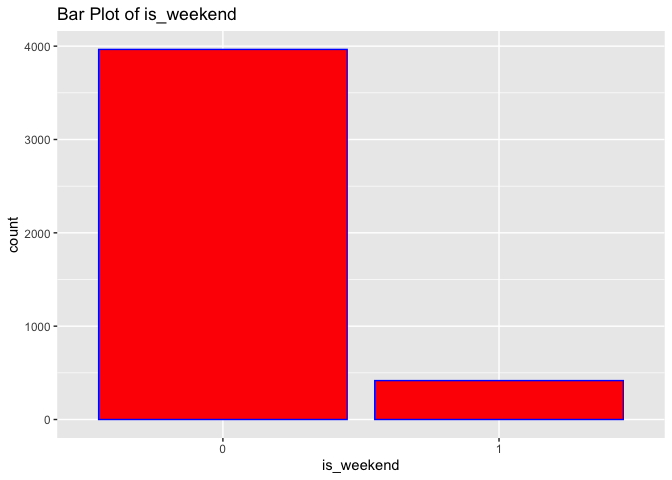
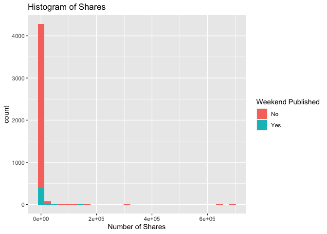
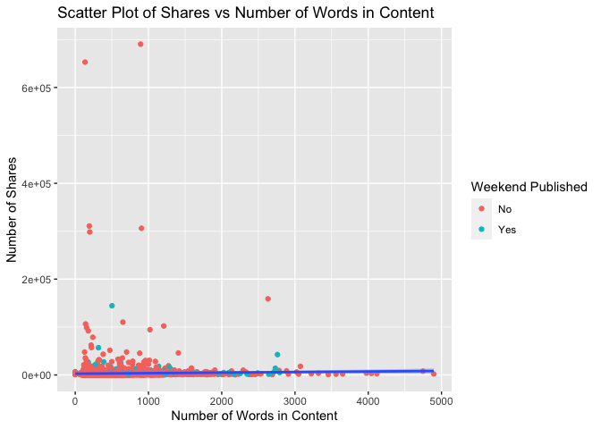

ST558 Project2
================
Shan Luo, Chengxi Zhou
2022-07-03

``` r
rmarkdown::render("ST558_Project2_Group10.Rmd", output_file = "lifestyle.html", params = list(Channels = 'data_channel_is_bus'))
```

# Introduction

``` r
# Read in data and subset data
News <- read_csv("OnlineNewsPopularity.csv", show_col_types = FALSE) 
News <- News %>% 
  filter(!!rlang::sym(params$Channels) == 1) %>%
  select(shares, n_tokens_content, num_imgs, num_videos,
         global_rate_positive_words, global_subjectivity, is_weekend)
News$is_weekend <- factor(News$is_weekend)
```

``` r
# Split train and test data
set.seed(1)
trainIndex <- createDataPartition(News$shares, p = 0.7, list = FALSE)
train <- News[trainIndex, ]
test <- News[-trainIndex, ]
```

``` r
# Check correlation of all interested variables
cor(select(News ,shares, n_tokens_content, num_imgs, num_videos,
           global_rate_positive_words, global_subjectivity))
```

    ##                                shares n_tokens_content
    ## shares                     1.00000000        0.0279465
    ## n_tokens_content           0.02794650        1.0000000
    ## num_imgs                   0.02754498        0.2418600
    ## num_videos                 0.05049253        0.1448476
    ## global_rate_positive_words 0.01556270        0.1796506
    ## global_subjectivity        0.04781618        0.1688761
    ##                               num_imgs  num_videos
    ## shares                      0.02754498  0.05049253
    ## n_tokens_content            0.24186002  0.14484757
    ## num_imgs                    1.00000000 -0.01867361
    ## num_videos                 -0.01867361  1.00000000
    ## global_rate_positive_words -0.01946145  0.09339754
    ## global_subjectivity         0.04367761  0.06808586
    ##                            global_rate_positive_words
    ## shares                                     0.01556270
    ## n_tokens_content                           0.17965058
    ## num_imgs                                  -0.01946145
    ## num_videos                                 0.09339754
    ## global_rate_positive_words                 1.00000000
    ## global_subjectivity                        0.29051633
    ##                            global_subjectivity
    ## shares                              0.04781618
    ## n_tokens_content                    0.16887611
    ## num_imgs                            0.04367761
    ## num_videos                          0.06808586
    ## global_rate_positive_words          0.29051633
    ## global_subjectivity                 1.00000000

If two variables have high correlation, we may think about removing one
of them.

# EDA

## Numeric Summary Table

``` r
# Compute the summary statistics
apply(X = select(train, shares:global_subjectivity), MARGIN = 2,
      FUN = function(x) {
        summaries <- c(min(x), mean(x), median(x), max(x), sd(x), IQR(x))
        names(summaries) <- c("Min", "Mean", "Median", "Max", "Sd", "IQR")
        summaries
      })
```

    ##           shares n_tokens_content  num_imgs num_videos
    ## Min         1.00           0.0000  0.000000  0.0000000
    ## Mean     3196.29         535.7357  1.782063  0.6309904
    ## Median   1400.00         397.5000  1.000000  0.0000000
    ## Max    690400.00        4894.0000 51.000000 75.0000000
    ## Sd      17503.43         428.7966  3.495681  3.3544443
    ## IQR      1547.75         478.7500  0.000000  0.0000000
    ##        global_rate_positive_words global_subjectivity
    ## Min                    0.00000000          0.00000000
    ## Mean                   0.04314549          0.43541185
    ## Median                 0.04213172          0.43923517
    ## Max                    0.12396694          1.00000000
    ## Sd                     0.01630930          0.08372584
    ## IQR                    0.02182993          0.10276947

From numeric summary table, if one variable’s mean is greater than
median, it has a right skewed distribution. If the mean is less than
median, it has a left skewed distribution. If mean is close to median,
it may have a symmetric distribution. If the standard deviation is
unusual, there may be some outliers.

## Contingency Table

``` r
# Create contingency table of predictor "is_weekend"
table(train$is_weekend)
```

    ## 
    ##    0    1 
    ## 3965  417

From the contingency table, we can see how many articles are published
on weekday and weekend.

## Bar Plot

``` r
# Create bar plot of predictor "is_weekend"
g <- ggplot(data = train, aes(x = is_weekend))
g + geom_bar(fill = "Red", color = "Blue") +
  labs(title = "Bar Plot of is_weekend")
```

<!-- -->

From the bar plot, we can see how many articles are published on weekday
and weekend and visualize the difference.

``` r
# Create histogram of response "shares" and fill with predictor "is_weekend"
g <- ggplot(data = train, aes(x = shares))
g + geom_histogram(bins = 30, aes(fill = is_weekend)) +
  labs(x = "Number of Shares",
       title = "Histogram of Shares") +
  scale_fill_discrete(name = "Weekend Published", labels = c("No", "Yes"))
```

<!-- -->

For histogram, we can see the distribution of the number of shares. If
we have majority of count on the left side and less count on right side,
it may have a right skewed distribution. It indicates that most of
articles have small number of shares. If we have majority of count on
the right side and less count on left side, it may have a left skewed
distribution. It indicates that most of articles have large number of
shares. If we see a bell shape, it may have a symmetric distribution. It
indicating most of articles have relatively large shares.

``` r
# Create scatter plot of response "shares" and predictor "n_tokens_content".
# Filled with predictor "is_weekend"
g <- ggplot(data = train, aes(x = n_tokens_content, y = shares))
g + geom_point(aes(color = is_weekend)) +
  geom_smooth(method = "lm") +
  labs(x = "Number of Words in Content",
       y = "Number of Shares",
       title = "Scatter Plot of Shares vs Number of Words in Content") +
  scale_color_discrete(name = "Weekend Published", labels = c("No", "Yes"))
```

    ## `geom_smooth()` using formula 'y ~ x'

<!-- -->

We can inspect the trend of shares as a function of the number of words
in content. If the points show an upward trend, then articles with more
number of words in the content to be shared more often. If we see a
negative trend then articles with more number of words in the content
tend to be shared less often.

# Modeling

## Linear Regression

Regression models allow easy prediction of response and inference.
Linear regression is that we model a response as a linear function of
some predictors. Model fit by minimizing the sum of squared residuals.

``` r
# Fit linear model
mod <- lm(shares ~ (n_tokens_content + num_imgs + num_videos + 
                      global_rate_positive_words + global_subjectivity + 
                      is_weekend)^2 ,data =  train)
# Use forward selection to  choose model
forward_mod <- step(mod, direction = "forward")
```

    ## Start:  AIC=85624.26
    ## shares ~ (n_tokens_content + num_imgs + num_videos + global_rate_positive_words + 
    ##     global_subjectivity + is_weekend)^2

``` r
lmfit1 <- train(shares ~ (n_tokens_content + num_imgs + num_videos + 
                         global_rate_positive_words + global_subjectivity + 
                         is_weekend)^2,
             data = train,
             method = "lm",
             preProcess = c("center", "scale"),
             trControl = trainControl(method = "cv", number = 5))
lmfit1
```

    ## Linear Regression 
    ## 
    ## 4382 samples
    ##    6 predictor
    ## 
    ## Pre-processing: centered (21), scaled (21) 
    ## Resampling: Cross-Validated (5 fold) 
    ## Summary of sample sizes: 3506, 3506, 3505, 3505, 3506 
    ## Resampling results:
    ## 
    ##   RMSE      Rsquared     MAE     
    ##   14485.36  0.001512233  3051.479
    ## 
    ## Tuning parameter 'intercept' was held constant at a value of TRUE

``` r
lmpred1 <- predict(lmfit1, newdata = test) 
lm1 <- postResample(lmpred1, test$shares)
lm1
```

    ##         RMSE     Rsquared          MAE 
    ## 6.383288e+03 8.418169e-03 2.546020e+03

``` r
lmfit2 <- train(shares ~ n_tokens_content + num_imgs + num_videos + 
                         global_rate_positive_words + global_subjectivity + 
                         is_weekend,
             data = train,
             method = "lm",
             preProcess = c("center", "scale"),
             trControl = trainControl(method = "cv", number = 5))
lmfit2
```

    ## Linear Regression 
    ## 
    ## 4382 samples
    ##    6 predictor
    ## 
    ## Pre-processing: centered (6), scaled (6) 
    ## Resampling: Cross-Validated (5 fold) 
    ## Summary of sample sizes: 3506, 3506, 3505, 3506, 3505 
    ## Resampling results:
    ## 
    ##   RMSE     Rsquared    MAE     
    ##   15844.7  0.00361909  2970.739
    ## 
    ## Tuning parameter 'intercept' was held constant at a value of TRUE

``` r
lmpred2 <- predict(lmfit2, newdata = test) 
lm2 <- postResample(lmpred2, test$shares)
lm2
```

    ##         RMSE     Rsquared          MAE 
    ## 6.325338e+03 8.564971e-03 2.519141e+03

## Random Forest

Since the response is continuous, we choose to use regression tree.

The bootstrapping is that we resample from data or a fitted model and
apply method or estimation to each resample. We see how the model or
method behave.

For Bootstrap Aggregation(Bagged) for regression tree, we create a
bootstrap sample, train tree on the sample, repeat B = 1000 times, and
average over these predictions as final prediction.

Random forest follows Bootstrap Aggregation idea. We will create
multiple trees from bootstrap samples and average the results. But, we
will use a random subset of predictors for each bootstrap tree fit
instead of using all predictors. It may make bagged trees predictions
more correlated, which can help with reduction of variation.

``` r
rffit <- train(shares ~ n_tokens_content + num_imgs + num_videos + 
                         global_rate_positive_words + global_subjectivity + 
                         is_weekend, 
               data = train, 
               method = "rf", 
               trControl = trainControl(method = "cv", number = 5), 
               preProcess = c("center", "scale"),
               tuneGrid = data.frame(mtry = 1:6))
rffit
```

    ## Random Forest 
    ## 
    ## 4382 samples
    ##    6 predictor
    ## 
    ## Pre-processing: centered (6), scaled (6) 
    ## Resampling: Cross-Validated (5 fold) 
    ## Summary of sample sizes: 3506, 3505, 3505, 3506, 3506 
    ## Resampling results across tuning parameters:
    ## 
    ##   mtry  RMSE      Rsquared     MAE     
    ##   1     16469.87  0.009617242  2915.181
    ##   2     16788.95  0.005718178  3027.038
    ##   3     17010.52  0.004587511  3104.319
    ##   4     17188.73  0.002916106  3123.196
    ##   5     17278.33  0.002417626  3146.174
    ##   6     17533.73  0.002157841  3169.087
    ## 
    ## RMSE was used to select the optimal model using the
    ##  smallest value.
    ## The final value used for the model was mtry = 1.

``` r
rfpred <- predict(rffit, newdata = test) 
rf <- postResample(rfpred, test$shares)
rf
```

    ##         RMSE     Rsquared          MAE 
    ## 6.749397e+03 1.709155e-02 2.530312e+03

## Boosted Tree

Boosting is a way that slowly trains the tree so that the tree do not
over fit. For boosting, trees grow sequentially and each subsequent tree
is grown on a modified version of original data. Prediction updates as
trees grown.

The process of boosted tree: 1. Initialized prediction as 0 2. Find
residuals(observed-predicted) 3. Fit a tree with d splits(d + 1 terminal
nodes) treating the residuals as response 4. Update predictions 5.
Update residuals for new predictions and repeat B times

``` r
boostedTfit <- train(shares ~ n_tokens_content + num_imgs + num_videos + 
                         global_rate_positive_words + global_subjectivity + 
                         is_weekend, 
               data = train, 
               method = "gbm", 
               trControl = trainControl(method = "cv", number = 5), 
               preProcess = c("center", "scale"),
               tuneGrid = data.frame(expand.grid(n.trees = c(25,50,100,150,200), 
                                                 interaction.depth = 1:4,
                                                 shrinkage = 0.1,
                                                 n.minobsinnode = 10)),
               verbose = FALSE)
boostedTfit
```

    ## Stochastic Gradient Boosting 
    ## 
    ## 4382 samples
    ##    6 predictor
    ## 
    ## Pre-processing: centered (6), scaled (6) 
    ## Resampling: Cross-Validated (5 fold) 
    ## Summary of sample sizes: 3506, 3505, 3506, 3505, 3506 
    ## Resampling results across tuning parameters:
    ## 
    ##   interaction.depth  n.trees  RMSE      Rsquared     MAE     
    ##   1                   25      14850.09  0.009088783  2982.503
    ##   1                   50      14914.65  0.010381570  3036.323
    ##   1                  100      14963.12  0.010821166  3042.530
    ##   1                  150      14946.07  0.011986097  3052.441
    ##   1                  200      14981.06  0.012013545  3064.032
    ##   2                   25      15192.47  0.002628138  3049.463
    ##   2                   50      15450.43  0.002614034  3171.166
    ##   2                  100      15906.49  0.001444184  3390.461
    ##   2                  150      16250.20  0.001451488  3555.454
    ##   2                  200      16436.87  0.001059608  3666.209
    ##   3                   25      15306.31  0.008720493  3127.793
    ##   3                   50      15644.66  0.005743648  3258.025
    ##   3                  100      16030.71  0.003128287  3452.532
    ##   3                  150      16368.19  0.002400773  3608.822
    ##   3                  200      16650.96  0.001846115  3738.260
    ##   4                   25      15379.79  0.008354468  3135.691
    ##   4                   50      15771.24  0.004449548  3328.814
    ##   4                  100      16310.56  0.004141212  3592.908
    ##   4                  150      16388.74  0.004656619  3671.483
    ##   4                  200      16750.53  0.003481932  3803.159
    ## 
    ## Tuning parameter 'shrinkage' was held constant at a value of
    ##  0.1
    ## Tuning parameter 'n.minobsinnode' was held constant at
    ##  a value of 10
    ## RMSE was used to select the optimal model using the
    ##  smallest value.
    ## The final values used for the model were n.trees =
    ##  25, interaction.depth = 1, shrinkage = 0.1 and n.minobsinnode
    ##  = 10.

``` r
boostedpre <- predict(boostedTfit, newdata = test) 
boosted <- postResample(boostedpre, test$shares)
boosted
```

    ##         RMSE     Rsquared          MAE 
    ## 6.468740e+03 1.071884e-02 2.596004e+03

``` r
allRMSE <- tibble(lm1[1], lm2[1], rf[1], boosted[1])
names(allRMSE) <- c("LinearRegression1", "LinearRegression2", "RandomForest", "BoostedTree")
RMSElong <- allRMSE %>%
  pivot_longer(cols = 1:4, names_to = "Model", values_to = "RMSE")
RMSE_sort <- RMSElong %>% 
  arrange(RMSE)
RMSE_sort[1,]
```

    ## # A tibble: 1 × 2
    ##   Model              RMSE
    ##   <chr>             <dbl>
    ## 1 LinearRegression2 6325.

The result is the best model and its RMSE.

# Automation

``` r
channels <- c("data_channel_is_lifestyle", "data_channel_is_entertainment", "data_channel_is_bus", "data_channel_is_socmed", "data_channel_is_tech", "data_channel_is_world")
# Create file names
output_file <- paste0(channels, "Analysis.md")
# Create a list for each channel with just channel name parameter
params <- lapply(channels, FUN = function(x){
  list(Channels = x)
})
# Put into a data frame
reports <- tibble(output_file, params)
apply(reports, MARGIN = 1, FUN = function(x) {
  render(input = "ST558_Project2_Group10.Rmd", 
         output_format = "github_document", 
         output_file = x[[1]], 
         params = x[[2]], 
         output_options = list(html_preview = FALSE)) 
})
```
