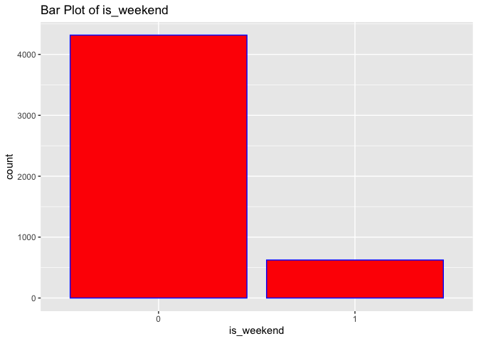
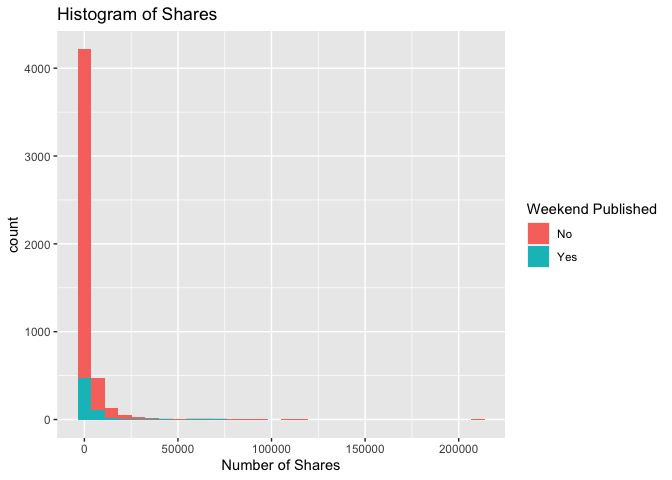
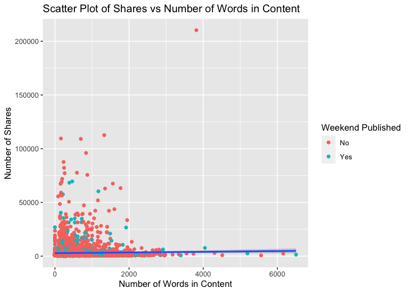

ST558 Project2
================
Shan Luo, Chengxi Zhou
2022-07-03

``` r
rmarkdown::render("ST558_Project2_Group10.Rmd", output_file = "lifestyle.html", params = list(Channels = 'data_channel_is_bus'))
```

# Introduction

``` r
# Read in data and subset data
News <- read_csv("OnlineNewsPopularity.csv", show_col_types = FALSE) 
News <- News %>% 
  filter(!!rlang::sym(params$Channels) == 1) %>%
  select(shares, n_tokens_content, num_imgs, num_videos,
         global_rate_positive_words, global_subjectivity, is_weekend)
News$is_weekend <- factor(News$is_weekend)
```

``` r
# Split train and test data
set.seed(1)
trainIndex <- createDataPartition(News$shares, p = 0.7, list = FALSE)
train <- News[trainIndex, ]
test <- News[-trainIndex, ]
```

``` r
# Check correlation of all interested variables
cor(select(News ,shares, n_tokens_content, num_imgs, num_videos,
           global_rate_positive_words, global_subjectivity))
```

    ##                                   shares n_tokens_content
    ## shares                      1.0000000000       0.01122183
    ## n_tokens_content            0.0112218266       1.00000000
    ## num_imgs                    0.0380929838       0.45651521
    ## num_videos                 -0.0005863698       0.22889984
    ## global_rate_positive_words -0.0184416672       0.12416447
    ## global_subjectivity         0.0375108090       0.12504848
    ##                               num_imgs    num_videos
    ## shares                      0.03809298 -0.0005863698
    ## n_tokens_content            0.45651521  0.2288998392
    ## num_imgs                    1.00000000 -0.0962389701
    ## num_videos                 -0.09623897  1.0000000000
    ## global_rate_positive_words -0.16224682  0.1121887841
    ## global_subjectivity        -0.03906866  0.0442863698
    ##                            global_rate_positive_words
    ## shares                                    -0.01844167
    ## n_tokens_content                           0.12416447
    ## num_imgs                                  -0.16224682
    ## num_videos                                 0.11218878
    ## global_rate_positive_words                 1.00000000
    ## global_subjectivity                        0.45868687
    ##                            global_subjectivity
    ## shares                              0.03751081
    ## n_tokens_content                    0.12504848
    ## num_imgs                           -0.03906866
    ## num_videos                          0.04428637
    ## global_rate_positive_words          0.45868687
    ## global_subjectivity                 1.00000000

If two variables have high correlation, we may think about removing one
of them.

# EDA

## Numeric Summary Table

``` r
# Compute the summary statistics
apply(X = select(train, shares:global_subjectivity), MARGIN = 2,
      FUN = function(x) {
        summaries <- c(min(x), mean(x), median(x), max(x), sd(x), IQR(x))
        names(summaries) <- c("Min", "Mean", "Median", "Max", "Sd", "IQR")
        summaries
      })
```

    ##            shares n_tokens_content   num_imgs num_videos
    ## Min        47.000           0.0000   0.000000   0.000000
    ## Mean     2964.849         608.3457   6.401741   2.633273
    ## Median   1200.000         436.0000   1.000000   1.000000
    ## Max    210300.000        6505.0000 128.000000  74.000000
    ## Sd       7429.049         530.0411  11.734992   6.433992
    ## IQR      1268.000         549.0000   7.000000   1.000000
    ##        global_rate_positive_words global_subjectivity
    ## Min                    0.00000000           0.0000000
    ## Mean                   0.04054435           0.4515803
    ## Median                 0.04046243           0.4634863
    ## Max                    0.15277778           1.0000000
    ## Sd                     0.01700876           0.1127549
    ## IQR                    0.02169487           0.1007189

From numeric summary table, if one variable’s mean is greater than
median, it has a right skewed distribution. If the mean is less than
median, it has a left skewed distribution. If mean is close to median,
it may have a symmetric distribution. If the standard deviation is
unusual, there may be some outliers.

## Contingency Table

``` r
# Create contingency table of predictor "is_weekend"
table(train$is_weekend)
```

    ## 
    ##    0    1 
    ## 4317  624

From the contingency table, we can see how many articles are published
on weekday and weekend.

## Bar Plot

``` r
# Create bar plot of predictor "is_weekend"
g <- ggplot(data = train, aes(x = is_weekend))
g + geom_bar(fill = "Red", color = "Blue") +
  labs(title = "Bar Plot of is_weekend")
```

<!-- -->

From the bar plot, we can see how many articles are published on weekday
and weekend and visualize the difference.

``` r
# Create histogram of response "shares" and fill with predictor "is_weekend"
g <- ggplot(data = train, aes(x = shares))
g + geom_histogram(bins = 30, aes(fill = is_weekend)) +
  labs(x = "Number of Shares",
       title = "Histogram of Shares") +
  scale_fill_discrete(name = "Weekend Published", labels = c("No", "Yes"))
```

<!-- -->

For histogram, we can see the distribution of the number of shares. If
we have majority of count on the left side and less count on right side,
it may have a right skewed distribution. It indicates that most of
articles have small number of shares. If we have majority of count on
the right side and less count on left side, it may have a left skewed
distribution. It indicates that most of articles have large number of
shares. If we see a bell shape, it may have a symmetric distribution. It
indicating most of articles have relatively large shares.

``` r
# Create scatter plot of response "shares" and predictor "n_tokens_content".
# Filled with predictor "is_weekend"
g <- ggplot(data = train, aes(x = n_tokens_content, y = shares))
g + geom_point(aes(color = is_weekend)) +
  geom_smooth(method = "lm") +
  labs(x = "Number of Words in Content",
       y = "Number of Shares",
       title = "Scatter Plot of Shares vs Number of Words in Content") +
  scale_color_discrete(name = "Weekend Published", labels = c("No", "Yes"))
```

    ## `geom_smooth()` using formula 'y ~ x'

<!-- -->

We can inspect the trend of shares as a function of the number of words
in content. If the points show an upward trend, then articles with more
number of words in the content to be shared more often. If we see a
negative trend then articles with more number of words in the content
tend to be shared less often.

# Modeling

## Linear Regression

Regression models allow easy prediction of response and inference.
Linear regression is that we model a response as a linear function of
some predictors. Model fit by minimizing the sum of squared residuals.

``` r
# Fit linear model
mod <- lm(shares ~ (n_tokens_content + num_imgs + num_videos + 
                      global_rate_positive_words + global_subjectivity + 
                      is_weekend)^2 ,data =  train)
# Use forward selection to  choose model
forward_mod <- step(mod, direction = "forward")
```

    ## Start:  AIC=88065.14
    ## shares ~ (n_tokens_content + num_imgs + num_videos + global_rate_positive_words + 
    ##     global_subjectivity + is_weekend)^2

``` r
lmfit1 <- train(shares ~ (n_tokens_content + num_imgs + num_videos + 
                         global_rate_positive_words + global_subjectivity + 
                         is_weekend)^2,
             data = train,
             method = "lm",
             preProcess = c("center", "scale"),
             trControl = trainControl(method = "cv", number = 5))
lmfit1
```

    ## Linear Regression 
    ## 
    ## 4941 samples
    ##    6 predictor
    ## 
    ## Pre-processing: centered (21), scaled (21) 
    ## Resampling: Cross-Validated (5 fold) 
    ## Summary of sample sizes: 3953, 3952, 3953, 3953, 3953 
    ## Resampling results:
    ## 
    ##   RMSE      Rsquared     MAE     
    ##   7314.379  0.004694769  2952.155
    ## 
    ## Tuning parameter 'intercept' was held constant at a value of TRUE

``` r
lmpred1 <- predict(lmfit1, newdata = test) 
lm1 <- postResample(lmpred1, test$shares)
lm1
```

    ##         RMSE     Rsquared          MAE 
    ## 8.777780e+03 1.980457e-03 2.963373e+03

``` r
lmfit2 <- train(shares ~ n_tokens_content + num_imgs + num_videos + 
                         global_rate_positive_words + global_subjectivity + 
                         is_weekend,
             data = train,
             method = "lm",
             preProcess = c("center", "scale"),
             trControl = trainControl(method = "cv", number = 5))
lmfit2
```

    ## Linear Regression 
    ## 
    ## 4941 samples
    ##    6 predictor
    ## 
    ## Pre-processing: centered (6), scaled (6) 
    ## Resampling: Cross-Validated (5 fold) 
    ## Summary of sample sizes: 3953, 3952, 3954, 3952, 3953 
    ## Resampling results:
    ## 
    ##   RMSE      Rsquared     MAE     
    ##   7286.621  0.004135671  2930.536
    ## 
    ## Tuning parameter 'intercept' was held constant at a value of TRUE

``` r
lmpred2 <- predict(lmfit2, newdata = test) 
lm2 <- postResample(lmpred2, test$shares)
lm2
```

    ##         RMSE     Rsquared          MAE 
    ## 8.776320e+03 1.549287e-03 2.952636e+03

## Random Forest

Since the response is continuous, we choose to use regression tree.

The bootstrapping is that we resample from data or a fitted model and
apply method or estimation to each resample. We see how the model or
method behave.

For Bootstrap Aggregation(Bagged) for regression tree, we create a
bootstrap sample, train tree on the sample, repeat B = 1000 times, and
average over these predictions as final prediction.

Random forest follows Bootstrap Aggregation idea. We will create
multiple trees from bootstrap samples and average the results. But, we
will use a random subset of predictors for each bootstrap tree fit
instead of using all predictors. It may make bagged trees predictions
more correlated, which can help with reduction of variation.

``` r
rffit <- train(shares ~ n_tokens_content + num_imgs + num_videos + 
                         global_rate_positive_words + global_subjectivity + 
                         is_weekend, 
               data = train, 
               method = "rf", 
               trControl = trainControl(method = "cv", number = 5), 
               preProcess = c("center", "scale"),
               tuneGrid = data.frame(mtry = 1:6))
rffit
```

    ## Random Forest 
    ## 
    ## 4941 samples
    ##    6 predictor
    ## 
    ## Pre-processing: centered (6), scaled (6) 
    ## Resampling: Cross-Validated (5 fold) 
    ## Summary of sample sizes: 3952, 3953, 3953, 3952, 3954 
    ## Resampling results across tuning parameters:
    ## 
    ##   mtry  RMSE      Rsquared     MAE     
    ##   1     7295.400  0.006972556  2909.232
    ##   2     7450.808  0.005659564  3022.157
    ##   3     7531.800  0.005416409  3085.087
    ##   4     7614.271  0.004514498  3130.701
    ##   5     7680.963  0.004154748  3166.588
    ##   6     7722.623  0.003754230  3177.227
    ## 
    ## RMSE was used to select the optimal model using the
    ##  smallest value.
    ## The final value used for the model was mtry = 1.

``` r
rfpred <- predict(rffit, newdata = test) 
rf <- postResample(rfpred, test$shares)
rf
```

    ##         RMSE     Rsquared          MAE 
    ## 8.766636e+03 5.953112e-03 2.934643e+03

## Boosted Tree

Boosting is a way that slowly trains the tree so that the tree do not
over fit. For boosting, trees grow sequentially and each subsequent tree
is grown on a modified version of original data. Prediction updates as
trees grown.

The process of boosted tree: 1. Initialized prediction as 0 2. Find
residuals(observed-predicted) 3. Fit a tree with d splits(d + 1 terminal
nodes) treating the residuals as response 4. Update predictions 5.
Update residuals for new predictions and repeat B times

``` r
boostedTfit <- train(shares ~ n_tokens_content + num_imgs + num_videos + 
                         global_rate_positive_words + global_subjectivity + 
                         is_weekend, 
               data = train, 
               method = "gbm", 
               trControl = trainControl(method = "cv", number = 5), 
               preProcess = c("center", "scale"),
               tuneGrid = data.frame(expand.grid(n.trees = c(25,50,100,150,200), 
                                                 interaction.depth = 1:4,
                                                 shrinkage = 0.1,
                                                 n.minobsinnode = 10)),
               verbose = FALSE)
boostedTfit
```

    ## Stochastic Gradient Boosting 
    ## 
    ## 4941 samples
    ##    6 predictor
    ## 
    ## Pre-processing: centered (6), scaled (6) 
    ## Resampling: Cross-Validated (5 fold) 
    ## Summary of sample sizes: 3952, 3953, 3954, 3952, 3953 
    ## Resampling results across tuning parameters:
    ## 
    ##   interaction.depth  n.trees  RMSE      Rsquared     MAE     
    ##   1                   25      7172.035  0.000950524  2924.114
    ##   1                   50      7166.498  0.002049227  2921.380
    ##   1                  100      7172.343  0.002650812  2920.445
    ##   1                  150      7176.023  0.002787581  2906.588
    ##   1                  200      7164.104  0.003968891  2902.273
    ##   2                   25      7160.953  0.003817349  2896.841
    ##   2                   50      7165.014  0.005427011  2900.671
    ##   2                  100      7170.248  0.006478662  2893.968
    ##   2                  150      7176.568  0.006868315  2894.635
    ##   2                  200      7186.922  0.006552907  2903.927
    ##   3                   25      7171.177  0.003617290  2919.070
    ##   3                   50      7188.509  0.004267349  2919.001
    ##   3                  100      7224.669  0.004205826  2914.905
    ##   3                  150      7262.531  0.003296891  2953.449
    ##   3                  200      7284.385  0.003345853  2970.405
    ##   4                   25      7179.831  0.004148115  2919.139
    ##   4                   50      7212.179  0.005102514  2923.532
    ##   4                  100      7250.670  0.005866507  2947.186
    ##   4                  150      7297.206  0.005017331  2986.010
    ##   4                  200      7352.124  0.003691486  3010.851
    ## 
    ## Tuning parameter 'shrinkage' was held constant at a value of
    ##  0.1
    ## Tuning parameter 'n.minobsinnode' was held constant at
    ##  a value of 10
    ## RMSE was used to select the optimal model using the
    ##  smallest value.
    ## The final values used for the model were n.trees =
    ##  25, interaction.depth = 2, shrinkage = 0.1 and n.minobsinnode
    ##  = 10.

``` r
boostedpre <- predict(boostedTfit, newdata = test) 
boosted <- postResample(boostedpre, test$shares)
boosted
```

    ##         RMSE     Rsquared          MAE 
    ## 8.783755e+03 2.360770e-03 2.919918e+03

``` r
allRMSE <- tibble(lm1[1], lm2[1], rf[1], boosted[1])
names(allRMSE) <- c("LinearRegression1", "LinearRegression2", "RandomForest", "BoostedTree")
RMSElong <- allRMSE %>%
  pivot_longer(cols = 1:4, names_to = "Model", values_to = "RMSE")
RMSE_sort <- RMSElong %>% 
  arrange(RMSE)
RMSE_sort[1,]
```

    ## # A tibble: 1 × 2
    ##   Model         RMSE
    ##   <chr>        <dbl>
    ## 1 RandomForest 8767.

The result is the best model and its RMSE.

# Automation

``` r
channels <- c("data_channel_is_lifestyle", "data_channel_is_entertainment", "data_channel_is_bus", "data_channel_is_socmed", "data_channel_is_tech", "data_channel_is_world")
# Create file names
output_file <- paste0(channels, "Analysis.md")
# Create a list for each channel with just channel name parameter
params <- lapply(channels, FUN = function(x){
  list(Channels = x)
})
# Put into a data frame
reports <- tibble(output_file, params)
apply(reports, MARGIN = 1, FUN = function(x) {
  render(input = "ST558_Project2_Group10.Rmd", 
         output_format = "github_document", 
         output_file = x[[1]], 
         params = x[[2]], 
         output_options = list(html_preview = FALSE)) 
})
```
