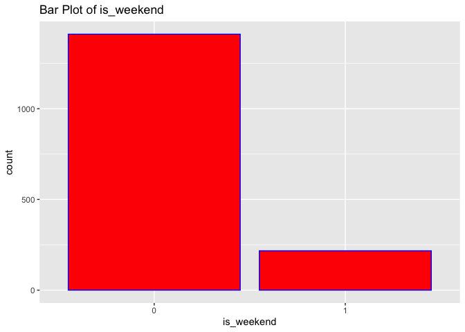
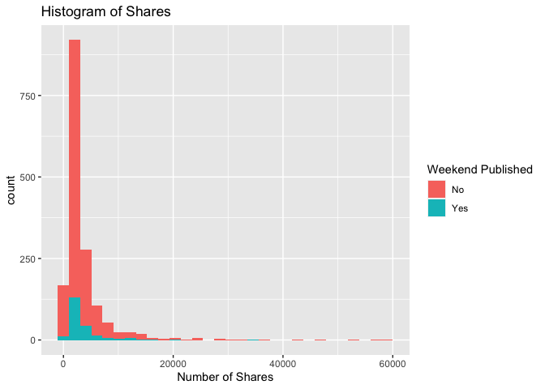
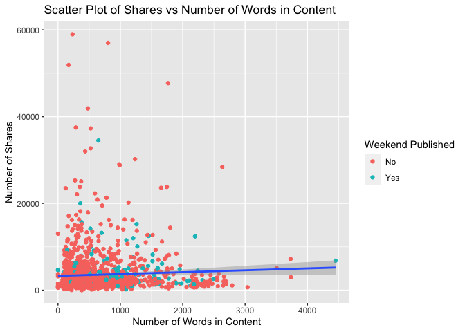

ST558 Project2
================
Shan Luo, Chengxi Zhou
2022-07-03

``` r
rmarkdown::render("ST558_Project2_Group10.Rmd", output_file = "lifestyle.html", params = list(Channels = 'data_channel_is_bus'))
```

# Introduction

``` r
# Read in data and subset data
News <- read_csv("OnlineNewsPopularity.csv", show_col_types = FALSE) 
News <- News %>% 
  filter(!!rlang::sym(params$Channels) == 1) %>%
  select(shares, n_tokens_content, num_imgs, num_videos,
         global_rate_positive_words, global_subjectivity, is_weekend)
News$is_weekend <- factor(News$is_weekend)
```

``` r
# Split train and test data
set.seed(1)
trainIndex <- createDataPartition(News$shares, p = 0.7, list = FALSE)
train <- News[trainIndex, ]
test <- News[-trainIndex, ]
```

``` r
# Check correlation of all interested variables
cor(select(News ,shares, n_tokens_content, num_imgs, num_videos,
           global_rate_positive_words, global_subjectivity))
```

    ##                                  shares n_tokens_content
    ## shares                      1.000000000       0.04795934
    ## n_tokens_content            0.047959339       1.00000000
    ## num_imgs                   -0.034796518       0.51969089
    ## num_videos                  0.015893010      -0.01768815
    ## global_rate_positive_words -0.007225248       0.08783301
    ## global_subjectivity        -0.007585586       0.11320093
    ##                               num_imgs  num_videos
    ## shares                     -0.03479652  0.01589301
    ## n_tokens_content            0.51969089 -0.01768815
    ## num_imgs                    1.00000000 -0.10202484
    ## num_videos                 -0.10202484  1.00000000
    ## global_rate_positive_words  0.05672248  0.11907336
    ## global_subjectivity         0.13071261  0.15330875
    ##                            global_rate_positive_words
    ## shares                                   -0.007225248
    ## n_tokens_content                          0.087833012
    ## num_imgs                                  0.056722478
    ## num_videos                                0.119073363
    ## global_rate_positive_words                1.000000000
    ## global_subjectivity                       0.262903823
    ##                            global_subjectivity
    ## shares                            -0.007585586
    ## n_tokens_content                   0.113200929
    ## num_imgs                           0.130712612
    ## num_videos                         0.153308750
    ## global_rate_positive_words         0.262903823
    ## global_subjectivity                1.000000000

If two variables have high correlation, we may think about removing one
of them.

# EDA

## Numeric Summary Table

``` r
# Compute the summary statistics
apply(X = select(train, shares:global_subjectivity), MARGIN = 2,
      FUN = function(x) {
        summaries <- c(min(x), mean(x), median(x), max(x), sd(x), IQR(x))
        names(summaries) <- c("Min", "Mean", "Median", "Max", "Sd", "IQR")
        summaries
      })
```

    ##           shares n_tokens_content  num_imgs num_videos
    ## Min        5.000           0.0000  0.000000   0.000000
    ## Mean    3550.980         605.7150  4.270885   1.068796
    ## Median  2100.000         435.0000  1.000000   0.000000
    ## Max    59000.000        4451.0000 62.000000  34.000000
    ## Sd      4761.087         547.4839  8.280483   3.075399
    ## IQR     2400.000         509.5000  2.000000   1.000000
    ##        global_rate_positive_words global_subjectivity
    ## Min                    0.00000000          0.00000000
    ## Mean                   0.04661518          0.45895234
    ## Median                 0.04575603          0.46090987
    ## Max                    0.15548780          0.92222222
    ## Sd                     0.01704840          0.09575491
    ## IQR                    0.02071903          0.10953052

From numeric summary table, if one variable’s mean is greater than
median, it has a right skewed distribution. If the mean is less than
median, it has a left skewed distribution. If mean is close to median,
it may have a symmetric distribution. If the standard deviation is
unusual, there may be some outliers.

## Contingency Table

``` r
# Create contingency table of predictor "is_weekend"
table(train$is_weekend)
```

    ## 
    ##    0    1 
    ## 1411  217

From the contingency table, we can see how many articles are published
on weekday and weekend.

## Bar Plot

``` r
# Create bar plot of predictor "is_weekend"
g <- ggplot(data = train, aes(x = is_weekend))
g + geom_bar(fill = "Red", color = "Blue") +
  labs(title = "Bar Plot of is_weekend")
```

<!-- -->

From the bar plot, we can see how many articles are published on weekday
and weekend and visualize the difference.

``` r
# Create histogram of response "shares" and fill with predictor "is_weekend"
g <- ggplot(data = train, aes(x = shares))
g + geom_histogram(bins = 30, aes(fill = is_weekend)) +
  labs(x = "Number of Shares",
       title = "Histogram of Shares") +
  scale_fill_discrete(name = "Weekend Published", labels = c("No", "Yes"))
```

<!-- -->

For histogram, we can see the distribution of the number of shares. If
we have majority of count on the left side and less count on right side,
it may have a right skewed distribution. It indicates that most of
articles have small number of shares. If we have majority of count on
the right side and less count on left side, it may have a left skewed
distribution. It indicates that most of articles have large number of
shares. If we see a bell shape, it may have a symmetric distribution. It
indicating most of articles have relatively large shares.

``` r
# Create scatter plot of response "shares" and predictor "n_tokens_content".
# Filled with predictor "is_weekend"
g <- ggplot(data = train, aes(x = n_tokens_content, y = shares))
g + geom_point(aes(color = is_weekend)) +
  geom_smooth(method = "lm") +
  labs(x = "Number of Words in Content",
       y = "Number of Shares",
       title = "Scatter Plot of Shares vs Number of Words in Content") +
  scale_color_discrete(name = "Weekend Published", labels = c("No", "Yes"))
```

    ## `geom_smooth()` using formula 'y ~ x'

<!-- -->

We can inspect the trend of shares as a function of the number of words
in content. If the points show an upward trend, then articles with more
number of words in the content to be shared more often. If we see a
negative trend then articles with more number of words in the content
tend to be shared less often.

# Modeling

## Linear Regression

Regression models allow easy prediction of response and inference.
Linear regression is that we model a response as a linear function of
some predictors. Model fit by minimizing the sum of squared residuals.

``` r
# Fit linear model
mod <- lm(shares ~ (n_tokens_content + num_imgs + num_videos + 
                      global_rate_positive_words + global_subjectivity + 
                      is_weekend)^2 ,data =  train)
# Use forward selection to  choose model
forward_mod <- step(mod, direction = "forward")
```

    ## Start:  AIC=27572.11
    ## shares ~ (n_tokens_content + num_imgs + num_videos + global_rate_positive_words + 
    ##     global_subjectivity + is_weekend)^2

``` r
lmfit1 <- train(shares ~ (n_tokens_content + num_imgs + num_videos + 
                         global_rate_positive_words + global_subjectivity + 
                         is_weekend)^2,
             data = train,
             method = "lm",
             preProcess = c("center", "scale"),
             trControl = trainControl(method = "cv", number = 5))
lmfit1
```

    ## Linear Regression 
    ## 
    ## 1628 samples
    ##    6 predictor
    ## 
    ## Pre-processing: centered (21), scaled (21) 
    ## Resampling: Cross-Validated (5 fold) 
    ## Summary of sample sizes: 1302, 1303, 1303, 1302, 1302 
    ## Resampling results:
    ## 
    ##   RMSE      Rsquared    MAE     
    ##   4712.735  0.01233963  2553.715
    ## 
    ## Tuning parameter 'intercept' was held constant at a value of TRUE

``` r
lmpred1 <- predict(lmfit1, newdata = test) 
lm1 <- postResample(lmpred1, test$shares)
lm1
```

    ##         RMSE     Rsquared          MAE 
    ## 7.058904e+03 4.129691e-03 2.880580e+03

``` r
lmfit2 <- train(shares ~ n_tokens_content + num_imgs + num_videos + 
                         global_rate_positive_words + global_subjectivity + 
                         is_weekend,
             data = train,
             method = "lm",
             preProcess = c("center", "scale"),
             trControl = trainControl(method = "cv", number = 5))
lmfit2
```

    ## Linear Regression 
    ## 
    ## 1628 samples
    ##    6 predictor
    ## 
    ## Pre-processing: centered (6), scaled (6) 
    ## Resampling: Cross-Validated (5 fold) 
    ## Summary of sample sizes: 1302, 1303, 1302, 1302, 1303 
    ## Resampling results:
    ## 
    ##   RMSE      Rsquared     MAE     
    ##   4744.656  0.006159736  2542.359
    ## 
    ## Tuning parameter 'intercept' was held constant at a value of TRUE

``` r
lmpred2 <- predict(lmfit2, newdata = test) 
lm2 <- postResample(lmpred2, test$shares)
lm2
```

    ##         RMSE     Rsquared          MAE 
    ## 6.994066e+03 1.323060e-03 2.826962e+03

## Random Forest

Since the response is continuous, we choose to use regression tree.

The bootstrapping is that we resample from data or a fitted model and
apply method or estimation to each resample. We see how the model or
method behave.

For Bootstrap Aggregation(Bagged) for regression tree, we create a
bootstrap sample, train tree on the sample, repeat B = 1000 times, and
average over these predictions as final prediction.

Random forest follows Bootstrap Aggregation idea. We will create
multiple trees from bootstrap samples and average the results. But, we
will use a random subset of predictors for each bootstrap tree fit
instead of using all predictors. It may make bagged trees predictions
more correlated, which can help with reduction of variation.

``` r
rffit <- train(shares ~ n_tokens_content + num_imgs + num_videos + 
                         global_rate_positive_words + global_subjectivity + 
                         is_weekend, 
               data = train, 
               method = "rf", 
               trControl = trainControl(method = "cv", number = 5), 
               preProcess = c("center", "scale"),
               tuneGrid = data.frame(mtry = 1:6))
rffit
```

    ## Random Forest 
    ## 
    ## 1628 samples
    ##    6 predictor
    ## 
    ## Pre-processing: centered (6), scaled (6) 
    ## Resampling: Cross-Validated (5 fold) 
    ## Summary of sample sizes: 1303, 1303, 1302, 1302, 1302 
    ## Resampling results across tuning parameters:
    ## 
    ##   mtry  RMSE      Rsquared    MAE     
    ##   1     4733.677  0.01402371  2522.230
    ##   2     4791.911  0.01515585  2595.477
    ##   3     4819.053  0.01271296  2626.040
    ##   4     4831.925  0.01287163  2639.185
    ##   5     4848.970  0.01315485  2663.186
    ##   6     4858.789  0.01308495  2668.930
    ## 
    ## RMSE was used to select the optimal model using the
    ##  smallest value.
    ## The final value used for the model was mtry = 1.

``` r
rfpred <- predict(rffit, newdata = test) 
rf <- postResample(rfpred, test$shares)
rf
```

    ##         RMSE     Rsquared          MAE 
    ## 6.979104e+03 4.657803e-03 2.797035e+03

## Boosted Tree

Boosting is a way that slowly trains the tree so that the tree do not
over fit. For boosting, trees grow sequentially and each subsequent tree
is grown on a modified version of original data. Prediction updates as
trees grown.

The process of boosted tree: 1. Initialized prediction as 0 2. Find
residuals(observed-predicted) 3. Fit a tree with d splits(d + 1 terminal
nodes) treating the residuals as response 4. Update predictions 5.
Update residuals for new predictions and repeat B times

``` r
boostedTfit <- train(shares ~ n_tokens_content + num_imgs + num_videos + 
                         global_rate_positive_words + global_subjectivity + 
                         is_weekend, 
               data = train, 
               method = "gbm", 
               trControl = trainControl(method = "cv", number = 5), 
               preProcess = c("center", "scale"),
               tuneGrid = data.frame(expand.grid(n.trees = c(25,50,100,150,200), 
                                                 interaction.depth = 1:4,
                                                 shrinkage = 0.1,
                                                 n.minobsinnode = 10)),
               verbose = FALSE)
boostedTfit
```

    ## Stochastic Gradient Boosting 
    ## 
    ## 1628 samples
    ##    6 predictor
    ## 
    ## Pre-processing: centered (6), scaled (6) 
    ## Resampling: Cross-Validated (5 fold) 
    ## Summary of sample sizes: 1302, 1303, 1303, 1302, 1302 
    ## Resampling results across tuning parameters:
    ## 
    ##   interaction.depth  n.trees  RMSE      Rsquared    MAE     
    ##   1                   25      4659.934  0.01029793  2525.041
    ##   1                   50      4651.561  0.01284836  2520.372
    ##   1                  100      4644.652  0.01551702  2505.630
    ##   1                  150      4642.248  0.01797700  2505.679
    ##   1                  200      4646.915  0.01808770  2504.832
    ##   2                   25      4640.214  0.01978086  2510.338
    ##   2                   50      4653.636  0.01744219  2508.748
    ##   2                  100      4682.617  0.01976049  2541.202
    ##   2                  150      4705.703  0.01994526  2560.938
    ##   2                  200      4730.972  0.02076112  2588.102
    ##   3                   25      4643.710  0.02395573  2502.624
    ##   3                   50      4670.813  0.02070700  2514.160
    ##   3                  100      4730.472  0.01976353  2562.115
    ##   3                  150      4770.928  0.01680733  2591.788
    ##   3                  200      4803.710  0.01561614  2639.840
    ##   4                   25      4633.340  0.02392486  2495.215
    ##   4                   50      4676.955  0.02202082  2526.806
    ##   4                  100      4780.339  0.01348942  2608.422
    ##   4                  150      4843.461  0.01089885  2670.320
    ##   4                  200      4879.576  0.01095484  2714.052
    ## 
    ## Tuning parameter 'shrinkage' was held constant at a value of
    ##  0.1
    ## Tuning parameter 'n.minobsinnode' was held constant at
    ##  a value of 10
    ## RMSE was used to select the optimal model using the
    ##  smallest value.
    ## The final values used for the model were n.trees =
    ##  25, interaction.depth = 4, shrinkage = 0.1 and n.minobsinnode
    ##  = 10.

``` r
boostedpre <- predict(boostedTfit, newdata = test) 
boosted <- postResample(boostedpre, test$shares)
boosted
```

    ##         RMSE     Rsquared          MAE 
    ## 6.966031e+03 8.409261e-03 2.804476e+03

``` r
allRMSE <- tibble(lm1[1], lm2[1], rf[1], boosted[1])
names(allRMSE) <- c("LinearRegression1", "LinearRegression2", "RandomForest", "BoostedTree")
RMSElong <- allRMSE %>%
  pivot_longer(cols = 1:4, names_to = "Model", values_to = "RMSE")
RMSE_sort <- RMSElong %>% 
  arrange(RMSE)
RMSE_sort[1,]
```

    ## # A tibble: 1 × 2
    ##   Model        RMSE
    ##   <chr>       <dbl>
    ## 1 BoostedTree 6966.

The result is the best model and its RMSE.

# Automation

``` r
channels <- c("data_channel_is_lifestyle", "data_channel_is_entertainment", "data_channel_is_bus", "data_channel_is_socmed", "data_channel_is_tech", "data_channel_is_world")
# Create file names
output_file <- paste0(channels, "Analysis.md")
# Create a list for each channel with just channel name parameter
params <- lapply(channels, FUN = function(x){
  list(Channels = x)
})
# Put into a data frame
reports <- tibble(output_file, params)
apply(reports, MARGIN = 1, FUN = function(x) {
  render(input = "ST558_Project2_Group10.Rmd", 
         output_format = "github_document", 
         output_file = x[[1]], 
         params = x[[2]], 
         output_options = list(html_preview = FALSE)) 
})
```
